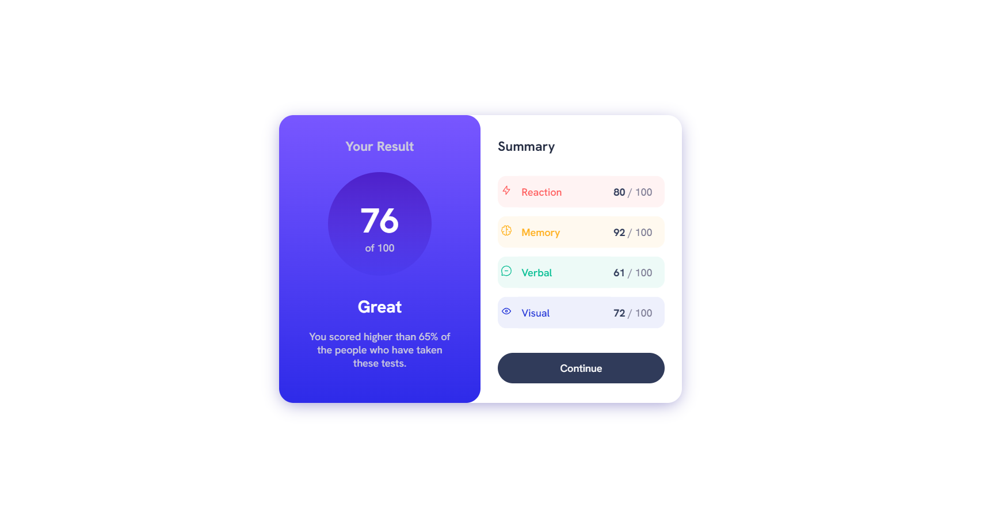

# Frontend Mentor - Results summary component solution

This is a solution to the [Results summary component challenge on Frontend Mentor](https://www.frontendmentor.io/challenges/results-summary-component-CE_K6s0maV). Frontend Mentor challenges help you improve your coding skills by building realistic projects. 

## Table of contents

- [Overview](#I've had some problems with the right section of project (this on a white background). I feel that my code here is far from beeing optimal
at this section, I hope I ll get some tips from you. However I did this task pretty 1:1 so I'm proud of me about this aspect. )
  - [The challenge](#Results summary component)
- [My process](#:>)
  - [Built with](#HTML & CSS only)
  - [What I learned](#formating tables)
- [Author](#Tomasz Zawadzki)
- [Acknowledgments](#To all of You )

## Overview

### The challenge

Users should be able to:

- View the optimal layout for the interface depending on their device's screen size
- See hover and focus states for all interactive elements on the page

### Screenshot

### Links

- Solution URL: [Add solution URL here](https://your-solution-url.com)
- Live Site URL: [Add live site URL here](https://your-live-site-url.com)

## My process

### Built with

- Semantic HTML5 markup
- CSS custom properties
- CSS Grid

## Author

- Frontend Mentor - [@ExpertoMontanero](https://www.frontendmentor.io/profile/ExpertoMontanero)
- Instagram - [@t_zawadzkiii](https://www.instagram.com/t_zawadzkiii/)

